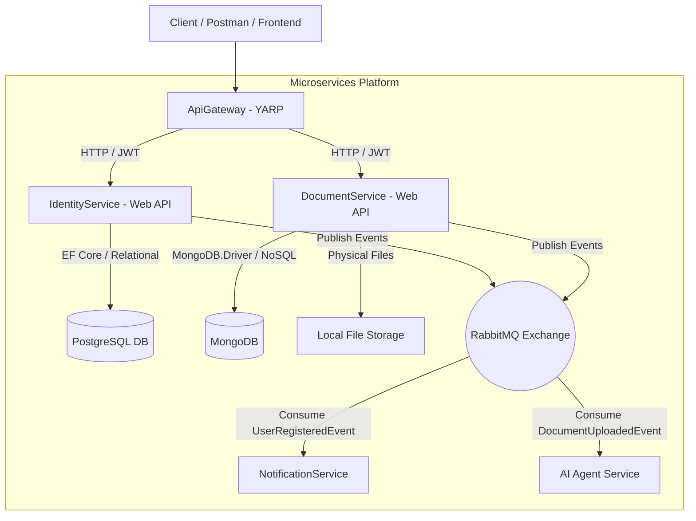

# SmartTaskPlatform 🚀


**SmartTaskPlatform** is an enterprise-grade, high-performance, **Event-Driven Microservices Platform** powered by Artificial Intelligence (AI).

This repository demonstrates modern software architecture principles (**Clean Architecture, CQRS, Result Pattern, Database-per-Service**) and enterprise design patterns implemented in .NET 10.

---

## 🏛️ System Architecture

The application adopts a **Microservices** architecture where each service manages its own dedicated database and domain boundaries. Inter-service communication is achieved asynchronously via **RabbitMQ + MassTransit**.



---

## 🧩 Microservices Breakdown

### 1. 🔐 IdentityService (PostgreSQL)
- **Responsibility:** User registration, password hashing, identity management, and JWT token issuance.
- **Tech Stack:** .NET 10, Entity Framework Core, PostgreSQL, BCrypt.Net, MediatR (CQRS).
- **Key Features:** BCrypt password hashing, JWT Bearer Token generation, CQRS pattern separation (`RegisterUserCommand`, `LoginUserQuery`).

### 2. 📄 DocumentService (MongoDB & File Storage)
- **Responsibility:** AI document upload, physical file storage, and metadata management.
- **Tech Stack:** MongoDB (NoSQL), Clean Architecture (4-Tier), Local File Storage, JWT Authorization.
- **Key Features:** 
  - Secure `multipart/form-data` file ingestion.
  - **Compensating Transactions** for orphan file cleanup in case of database or broker failures.
  - Asynchronous event publishing (`DocumentUploadedEvent`) to trigger downstream AI ingestion workflows.
  - Automatic `CurrentUserId` extraction from JWT token claims.

### 3. 🔔 NotificationService (RabbitMQ Consumer)
- **Responsibility:** Asynchronous notification processing based on system events.
- **Tech Stack:** MassTransit 8.3.6, RabbitMQ.
- **Key Features:** `IConsumer<UserRegisteredEvent>` integration for decoupled event processing.

### 4. 🧰 BuildingBlocks (Shared Libraries)
- **`BuildingBlocks.Core`:** Centralized `Result<T>` pattern, `AppResponse<T>`, `BaseController`, JWT extensions, and RFC-7807 compliant `GlobalExceptionHandler`.
- **`BuildingBlocks.Messaging`:** Event-Driven Infrastructure, `IEventBus` abstractions, and MassTransit RabbitMQ integration.

---

## 🛠️ Tech Stack & Design Patterns

| Category | Technology / Pattern | Description |
| :--- | :--- | :--- |
| **Framework** | .NET 10 (C# 13) | Latest high-performance .NET framework |
| **Architecture** | Clean Architecture & EDA | Decoupled layered architecture & Event-Driven messaging |
| **Design Patterns** | CQRS & Result Pattern | MediatR command/query separation & standardized result wrappers |
| **Databases** | PostgreSQL 15 & MongoDB 6.0 | Relational (Identity) and NoSQL (Documents) data persistence |
| **Messaging** | RabbitMQ & MassTransit 8.3.6 | Open-source enterprise service bus integration |
| **Security** | JWT Bearer & User Secrets | Claims-based authorization & local secret management |
| **Error Handling** | Global Exception Handler | Centralized RFC-7807 ProblemDetails exception interceptor |

---

## 🚀 Getting Started

### Prerequisites
- [.NET 10 SDK](https://dotnet.microsoft.com/download/dotnet/10.0)
- [Docker Desktop](https://www.docker.com/products/docker-desktop/)

### 1. Start Infrastructure Containers
Run Docker Compose in the root directory to spin up PostgreSQL, RabbitMQ, and MongoDB:
```bash
docker compose up -d
```

Service Management UIs:
- **RabbitMQ Management:** `http://localhost:15672` (Credentials: `guest` / `guest`)
- **PostgreSQL:** `localhost:5432` (Database: `agentic_db`)
- **MongoDB:** `localhost:27017` (Database: `DocumentDb`)

### 2. Configure User Secrets
Initialize and set local JWT signing keys:
```bash
dotnet user-secrets set "Jwt:SecretKey" "super_secret_key_smart_task_platform_2026_default!" --project src/Services/IdentityService/IdentityService.Api
dotnet user-secrets set "Jwt:SecretKey" "super_secret_key_smart_task_platform_2026_default!" --project src/Services/DocumentService/DocumentService.Api
```

### 3. Build & Run
```bash
dotnet build
```